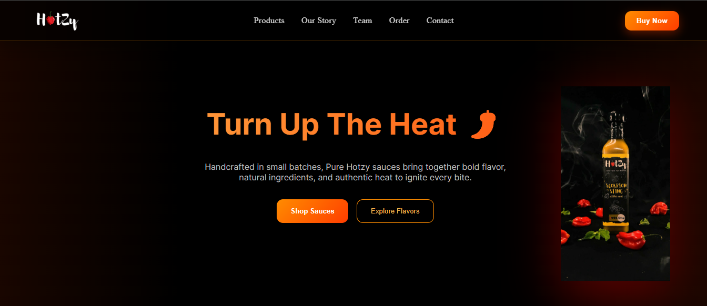
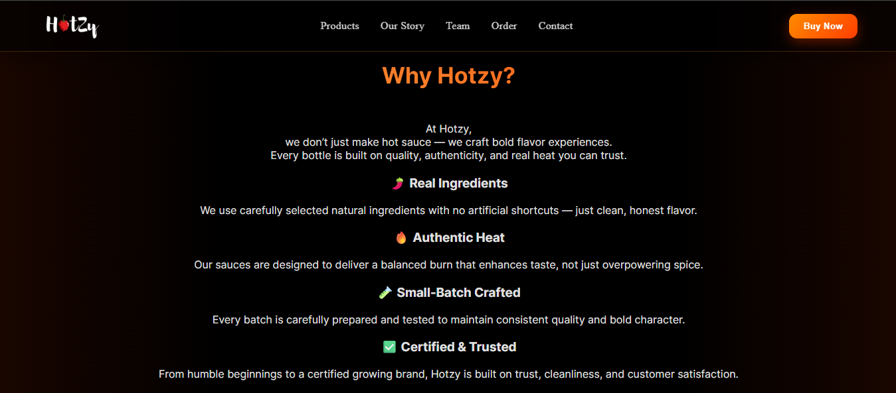
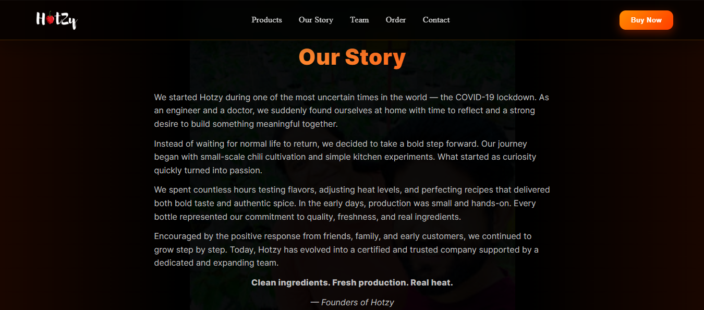
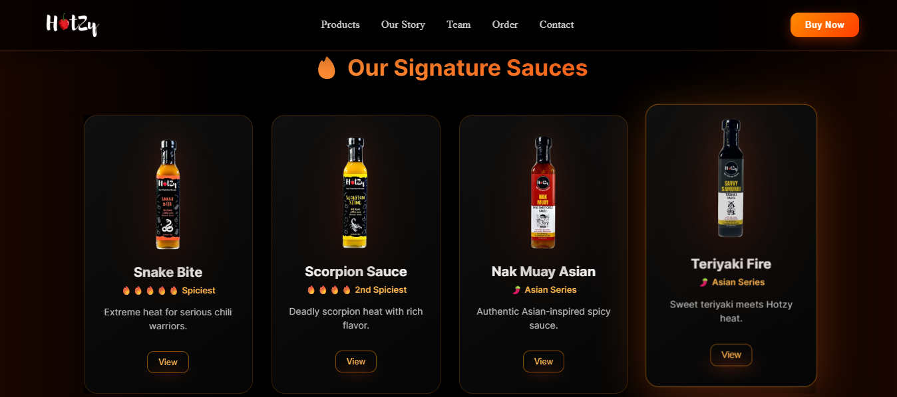
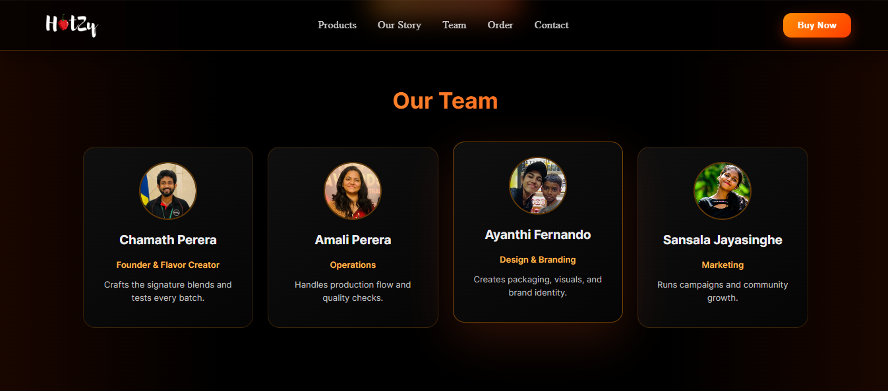
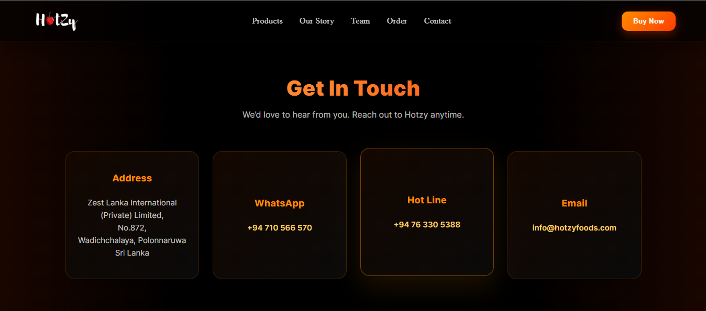
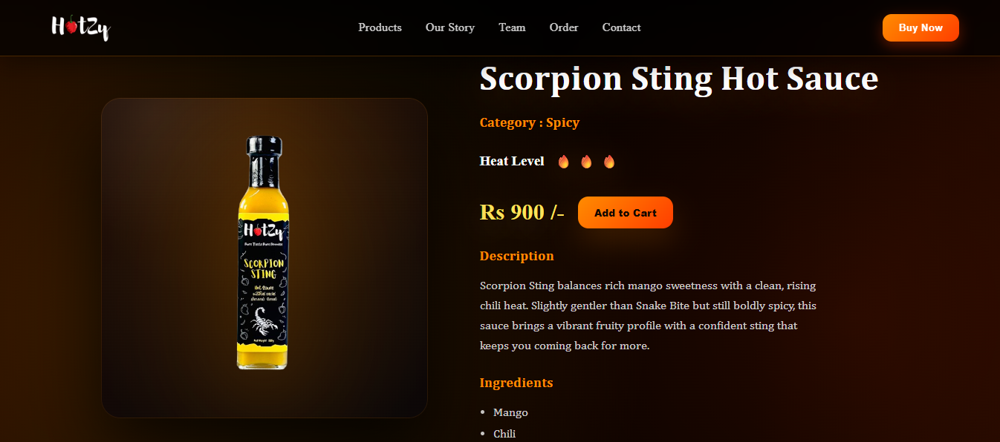

# 🌶️ Hotzy Sauce Website

A modern, responsive **hot sauce brand website** built with Angular.  
Hotzy showcases bold design, smooth UI interactions, and a premium product presentation experience.

---

## 🚀 Live Preview

🔗 _Add your deployed link here (Netlify / Vercel / GitHub Pages)_

---

## ✨ Features

- 🔥 Modern dark premium UI  
- 📱 Fully responsive design  
- 🎯 Smooth section-based navigation  
- 🛒 Product showcase with detail pages  
- 👥 Team introduction section  
- 📦 Order call-to-action section  
- 📞 Contact information section  
- ⚡ Fast and lightweight Angular frontend  

---

## 🖼️ Screenshots

### 🏠 Hero Section


### ❓ Why Hotzy


### 📖 Our Story


### 🌶️ Signature Sauces


### 🛒 Order Online


### 👥 Our Team


### 📞 Contact Section


### 🧴 Product Details


---

## 🛠️ Tech Stack

### Frontend
- Angular (Standalone Components)
- TypeScript
- SCSS
- HTML5

### Design
- Responsive Flexbox & Grid
- Gradient branding
- Modern dark theme UI

---

## 📂 Project Structure
hotzy-web/
├── src/
│ ├── app/
│ │ ├── components/ # Reusable UI components
│ │ ├── pages/ # Page-level views
│ │ └── services/ # Angular services
│ ├── assets/ # Images, fonts, static files
│ └── styles.scss # Global styles
├── angular.json # Angular configuration
└── package.json # Dependencies and scripts

---

## ⚙️ Getting Started

### 1️⃣ Clone the repository
```bash
git clone https://github.com/Kalana98/hotzy-web.git
cd hotzy-web
```

### 2️⃣ Install dependencies
```bash
npm install
```

### 3️⃣ Run the development server
```bash
ng serve
```

### 🌐 Visit
```
http://localhost:4200
```


